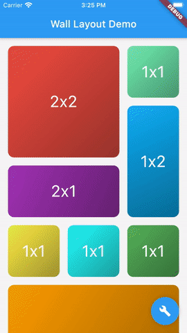
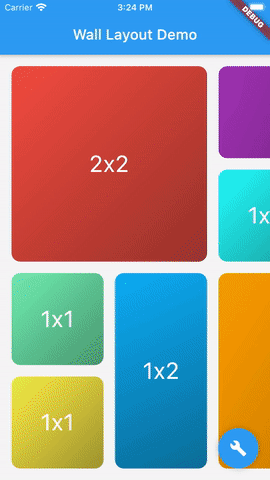

# flutter_wall_layout - Layout child having different shape into a vertical or horizontal list
This library provides a unique widget, WallLayout, rendering into a list children having different shapes.

 


There is two main classes: WallLayout and Stone. 
- A wall is composed by a set of stones, arranged in a certain way.
- A stone is a component defining its shape by a width and a height.

### Wall Layout Widget

This component has been inspired by the ListView widget, in which you can choose scroll direction and the way.
Added to that, you can also define how many rows or column have the wall, if you want to create a responsive design.
```dart
WallLayout(
  stones: _buildStonesList(),
  axisDivisions: 3,
  scrollDirection: Axis.vertical,
  reverse: false,
);
```

### Wall Layout Widget Properties

| Parameter          | Description                                       | Default value  |
| ------------------ | ------------------------------------------------- | -------------- |
| stones             | List of Stone widgets, representing wall layout's children. | -                       |
| axisDivisions      | Define the number of divisions the wall have. Must be higher or equal to 2. | -                       |
| stonePadding       | Padding between stones. | 16.0                    |
| scrollController   | Same as [ListView.scrollController]: "control the position to which this scroll view is scrolled". | -                       |
| physics            | Same as [ListView.physics]: "How the scroll view should respond to user input". | -                       |
| restorationId      | Same as [ListView.restorationId]: used "to save and restore the scroll offset of the scrollable". | -                       |
| dragStartBehavior  | Same as [ListView.dragStartBehavior]: "Determines the way that drag start behavior is handled". | DragStartBehavior.start |
| clipBehavior       | Same as [ListView.clipBehavior]: "ways to clip a widget's content". | Clip.hardEdge           |
| primary            | Same as [ListView.primary]: "Whether this is the primary scroll view associated with the parent [PrimaryScrollController]" | false                   |
| scrollDirection    | Same as [ListView.scrollDirection]: "axis along which the scroll view scrolls". | Axis.vertical           |
| reverse            | Same as [ListView.reverse property]: "whether the scroll view scrolls in the reading direction". | false                   |

### Stone Widget

A Stone Widget is a widget proxy defining stone's size (width and height).
It's rendered object is optimized thanks to it's id property.

```dart
Stone(
    id: 7,
    width: 2,
    height: 2,
    child: Container(
      color: Colors.red,
      child: Center(child: Text("2x2")),
    ),
);
 ```

### Stone Widget Properties

| Parameter | Description                                             | Default value |
| --------- | ------------------------------------------------------- | ------------- |
| width     | Stone width (relative to the number of wall divisions). Must be higher or equal to 1. | -             |
| height    | Stone height (relative to the number of wall divisions). Must be higher or equal to 1. | -             |
| id        | Proxy layout identifier: must be unique. | -             |
| child     | Widget to render, where its size will be constrained by the stone width and height. | -             |